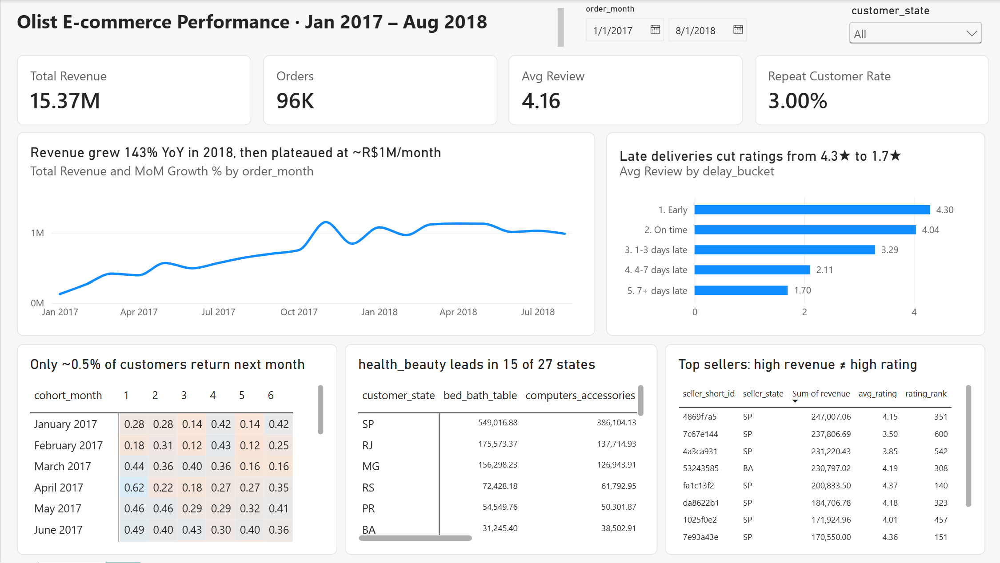

# Olist E-commerce Analysis (SQL · PostgreSQL · Power BI)

**Late deliveries are the biggest driver of bad reviews at Olist.** Orders that arrive more than a week late average **1.7★**, compared with **4.3★** for orders that arrive early. Retention is the weakest area: **only 3% of customers ever place a second order**.

The analysis covers 96K delivered orders (R$15.4M revenue, Jan 2017 – Aug 2018) from the [Olist Brazilian e-commerce dataset](https://www.kaggle.com/datasets/olistbr/brazilian-ecommerce). It uses PostgreSQL for the analysis and Power BI for the dashboard.



---

## Key findings

| # | Question | Finding |
|---|---|---|
| 1 | **Revenue trend** | Revenue for Jan–Aug 2018 was **up 143%** on the same period in 2017. Growth then stalled: from March 2018, monthly revenue plateaued at about **R$1.0–1.1M**, with month-over-month (MoM) changes within ±10%. Black Friday made Nov 2017 the peak month (**+54% MoM**), followed by a 27% drop in December. |
| 2 | **Delivery vs. reviews** | Review scores fall steadily as delays grow: **4.29★** for early deliveries, **3.29★** at 1–3 days late, and **1.70★** at 7+ days late. **79%** of orders more than a week late get a 1–2★ review. 92% of orders arrive *before* the estimated date, which suggests the estimates are padded. |
| 3 | **Top sellers** | Revenue is concentrated: **18.6% of sellers generate 80% of revenue**. Revenue and rating don't go together. None of the top 20 sellers by revenue are in the top 20 by rating, and the #2 seller by revenue ranks **600th of 620** on rating (3.50★). |
| 4 | **Retention** | Only **3.0%** of customers order again. Month-1 cohort retention averages **0.48%**. Customers whose first order arrived late came back at a rate of **2.59%**, compared with **3.03%** for on-time first orders. That gap is suggestive only (p ≈ 0.05). |
| 5 | **Category × region** | **São Paulo alone accounts for 37% of revenue**, and SP, RJ and MG together for 63%. Freight per item roughly **doubles** in the north-east (R$15 in SP vs. R$33 in PE and CE). **health_beauty** is the #1 category in **15 of 27** states. |

### Recommendations
1. **Make delivery reliability the main quality KPI.** Flag orders at risk of arriving more than 3 days late and contact those customers before they write a review.
2. **Build retention programs.** Test a second-purchase incentive (for example, a voucher timed near the 29-day median gap between first and second orders) and measure the result with the cohort matrix.
3. **Weight seller rankings by rating, not only volume.** High-volume sellers with low ratings are the biggest risk to overall satisfaction.
4. **Look into freight costs in the north and north-east.** High shipping costs are the most likely barrier to growth outside the south-east.

---

## Business questions → SQL

| Business question | SQL file | Techniques |
|---|---|---|
| Data quality and warm-up | [`01_data_quality.sql`](sql/01_data_quality.sql) | `UNION ALL`, `SUM() OVER ()` for % of total, `LEFT JOIN` + `COALESCE` |
| 1. Monthly revenue and growth | [`02_revenue_trend.sql`](sql/02_revenue_trend.sql) | CTE, `LAG()` for MoM and YoY growth, 3-month rolling average (`ROWS BETWEEN`) |
| 2. Delivery delay vs. review score | [`03_delivery_vs_reviews.sql`](sql/03_delivery_vs_reviews.sql) | Chained CTEs, `CASE` bucketing, date arithmetic, `CORR()` |
| 3. Top sellers by revenue and rating | [`04_sellers.sql`](sql/04_sellers.sql) | `RANK()`, running-total Pareto analysis, `FILTER`, `HAVING` minimum volume |
| 4. Repeat customers and cohort retention | [`05_retention_cohorts.sql`](sql/05_retention_cohorts.sql) | Cohort analysis, `MIN() OVER (PARTITION BY)`, `AGE()`, `ROW_NUMBER()`, `LEAD()`, `PERCENTILE_CONT` |
| 5. Category performance by region | [`06_category_by_region.sql`](sql/06_category_by_region.sql) | 5-table join, `DENSE_RANK() OVER (PARTITION BY)` for top-N per group |
| Dashboard data layer | [`07_powerbi_views.sql`](sql/07_powerbi_views.sql) | Views as a semantic layer, `generate_series` for a complete cohort grid |

---

## Data and method

**Dataset:** Olist Brazilian E-Commerce (Kaggle). There are 9 related tables: about 99K orders, 113K order items and 99K reviews, covering 2016–2018. The schema, keys and constraints are in [`00_schema.sql`](sql/00_schema.sql).

**Definitions**
- **Revenue** = `price + freight_value` from `order_items`, for **delivered** orders only.
- **Analysis window:** Jan 2017 – Aug 2018. 2016 is excluded because it is sparse and November 2016 has no orders at all. Sep–Oct 2018 is excluded because it has no delivered orders.
- **Customer** = `customer_unique_id`. The `customer_id` field is created per order, so using it would make every customer look new.
- **Delay** = actual delivery date − estimated delivery date, in days.

**Pitfalls handled**
- **Join fan-out:** orders have several items, payments and sometimes several reviews. Items and reviews are aggregated to one row per order *before* joining.
- **Duplicate reviews:** 551 orders have more than one review. Their scores are averaged per order.
- **Right-censored cohorts:** months after the end of the data show as NULL, not 0%, so recent cohorts don't look like they churned.
- **Missing translations:** 2 product categories have no English name. They fall back to the Portuguese name with `COALESCE`.

**Validation:** row counts after loading match the source CSVs. The totals in the Power BI views (R$15,373,120.01; 96,211 orders) match the standalone SQL queries exactly, and the dashboard KPIs match the SQL results.

**Limitations:** the effect of late delivery on repeat purchases is small and only borderline significant. The review scores are correlations, not causal effects. Repeat purchases on the same day (29.6% of second orders) are probably split baskets rather than true retention.

---

## Repository structure

```
├── sql/
│   ├── 00_schema.sql              # tables, keys, constraints, indexes
│   ├── 01_data_quality.sql        # warm-up and data profiling
│   ├── 02_revenue_trend.sql       # Q1
│   ├── 03_delivery_vs_reviews.sql # Q2
│   ├── 04_sellers.sql             # Q3
│   ├── 05_retention_cohorts.sql   # Q4
│   ├── 06_category_by_region.sql  # Q5
│   └── 07_powerbi_views.sql       # views used by the dashboard
├── python/load_data.py            # loads the CSVs into PostgreSQL with COPY
├── powerbi/olist_dashboard.pbix
├── images/dashboard.png
└── .env.example
```

## How to reproduce

1. Download the dataset from [Kaggle](https://www.kaggle.com/datasets/olistbr/brazilian-ecommerce) and unzip it into `data/raw/`.
2. Create a PostgreSQL database. This project used [Neon](https://neon.tech)'s free tier.
3. Copy `.env.example` to `.env` and add your connection string.
4. Install the dependencies and load the data:
   ```bash
   pip install pandas psycopg2-binary python-dotenv
   python python/load_data.py
   ```
5. Run the files in `sql/` in order. Run `07_powerbi_views.sql` before opening the dashboard.
6. Open `powerbi/olist_dashboard.pbix` and update the data source to point at your database.

## Tools

PostgreSQL (Neon) · Python (pandas, psycopg2) · Power BI (DAX) · Excel · Git/GitHub
